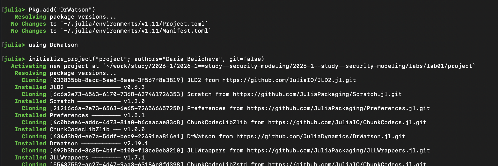
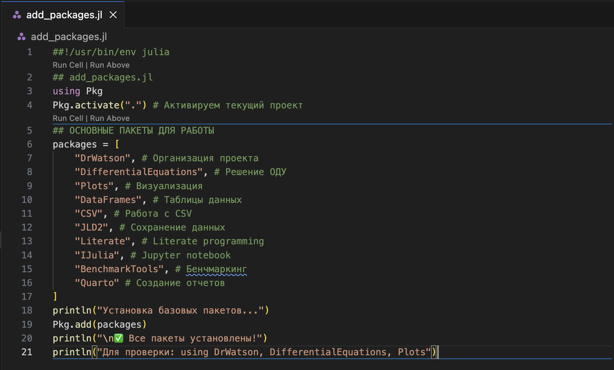
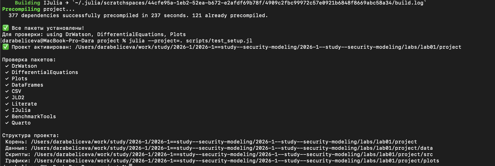
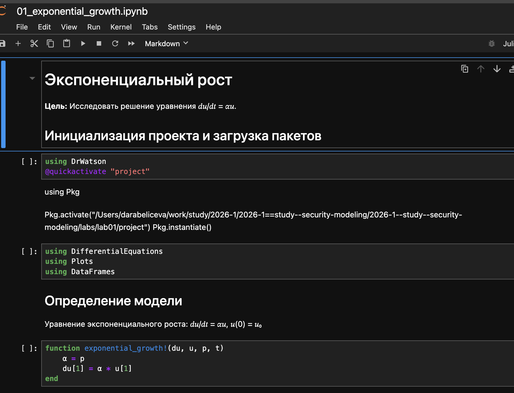
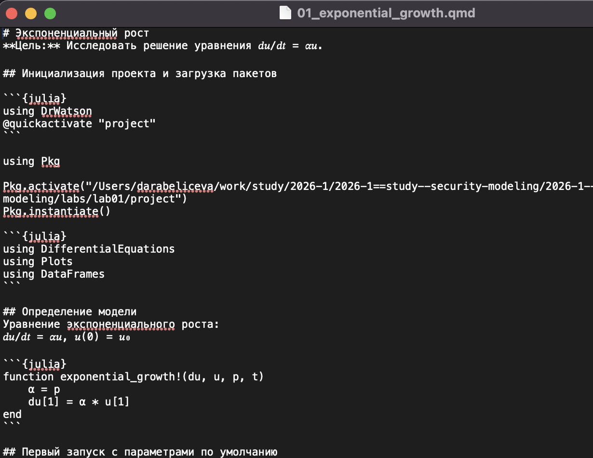
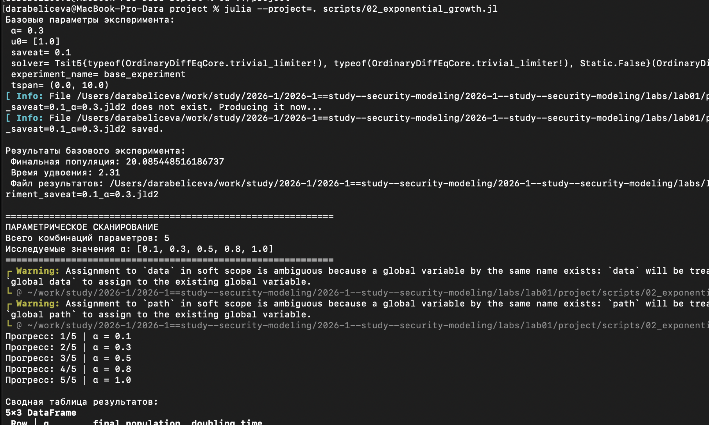

---
## Author
author:
  name: Беличева Дарья Михайловна
  degrees: DSc
  orcid: 0000-0002-0877-7063
  email: kulyabov-ds@rudn.ru
  affiliation:
    - name: Российский университет дружбы народов
      country: Российская Федерация
      postal-code: 117198
      city: Москва
      address: ул. Миклухо-Маклая, д. 6
## Title
title: Лабораторная работа №1
subtitle: Литературное программирование
license: CC BY
date: today
date-format: "YYYY-MM-DD" # Example: 2025-09-06
---

# Информация

## Докладчик

:::::::::::::: {.columns align=center}
::: {.column width="70%"}

  * Беличева Дарья Михайловна
  * студент
  * кафедра теории вероятностей и кибербезопасности
  * Российский университет дружбы народов им. П. Лумумбы
  * <https://dmbelicheva.github.io/ru/>

:::
::: {.column width="30%"}

{#fig-001 width=70%}

:::
::::::::::::::

## Цель работы

Изучить принципы воспроизводимых научных вычислений с использованием языка программирования Julia и пакетов DrWatson и Literate, а также освоить автоматическую генерацию различных форматов отчётов (скриптов, ноутбуков и документов Quarto) из единого исходного literate-скрипта.

## Задание

- Изучить структуру научного проекта, организованного с использованием пакета DrWatson.

- Освоить принципы literate-программирования, объединяющего программный код и документацию.

- Создать literate-скрипт, содержащий код модели и пояснения.

- Реализовать скрипт генерации производных форматов с использованием пакета Literate.

# Выполнение лабораторной работы

{#fig-001 width=70%}

## Выполнение лабораторной работы

{#fig-002 width=70%}

## Выполнение лабораторной работы

{#fig-004 width=70%}

## Выполнение лабораторной работы

{#fig-005 width=50%}

## Выполнение лабораторной работы

{#fig-006 width=70%}

## Выполнение лабораторной работы

{#fig-010 width=50%}

## Выполнение лабораторной работы

{#fig-011 width=50%}

## Выполнение лабораторной работы

{#fig-007 width=70%}

## Выполнение лабораторной работы

{#fig-008 width=70%}

# Выводы

В результате работы были освоены принципы literate-программирования и воспроизводимых вычислений, а также реализована автоматическая генерация различных форматов отчётов из единого исходного Julia-скрипта с использованием пакетов DrWatson и Literate.

# Список литературы

1. DrWatson.jl Documentation. — URL: https://juliadynamics.github.io/DrWatson.jl/stable/ (дата обр. 26.02.2026).

2. JuliaLang. — URL: https://julialang.org/ (дата обр. 26.02.2026).

3. Literate.jl Documentation. — URL: https://fredrikekre.github.io/Literate.jl/v2/ (дата обр. 26.02.2026).