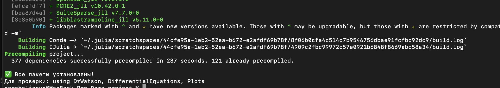
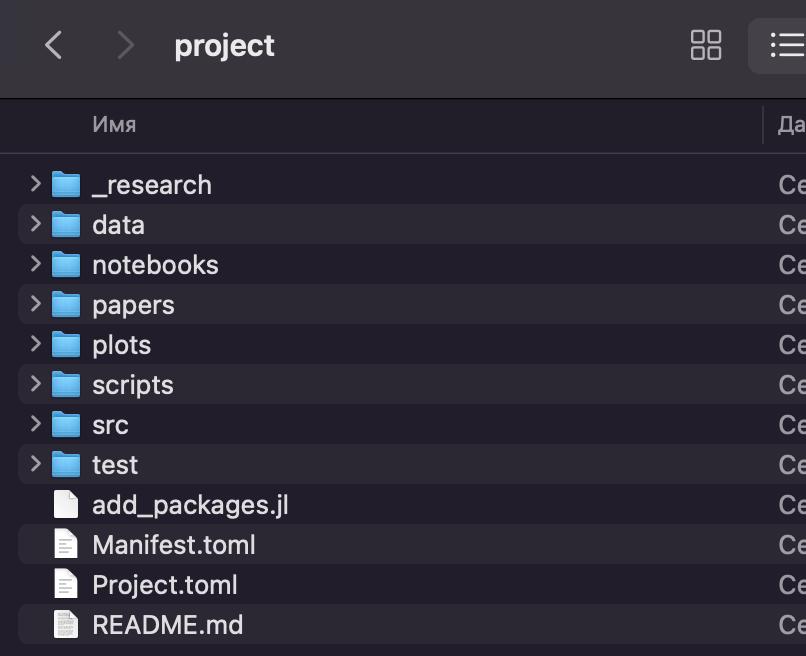
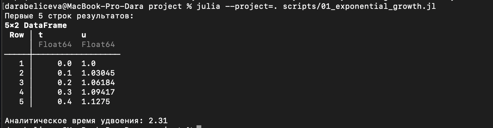
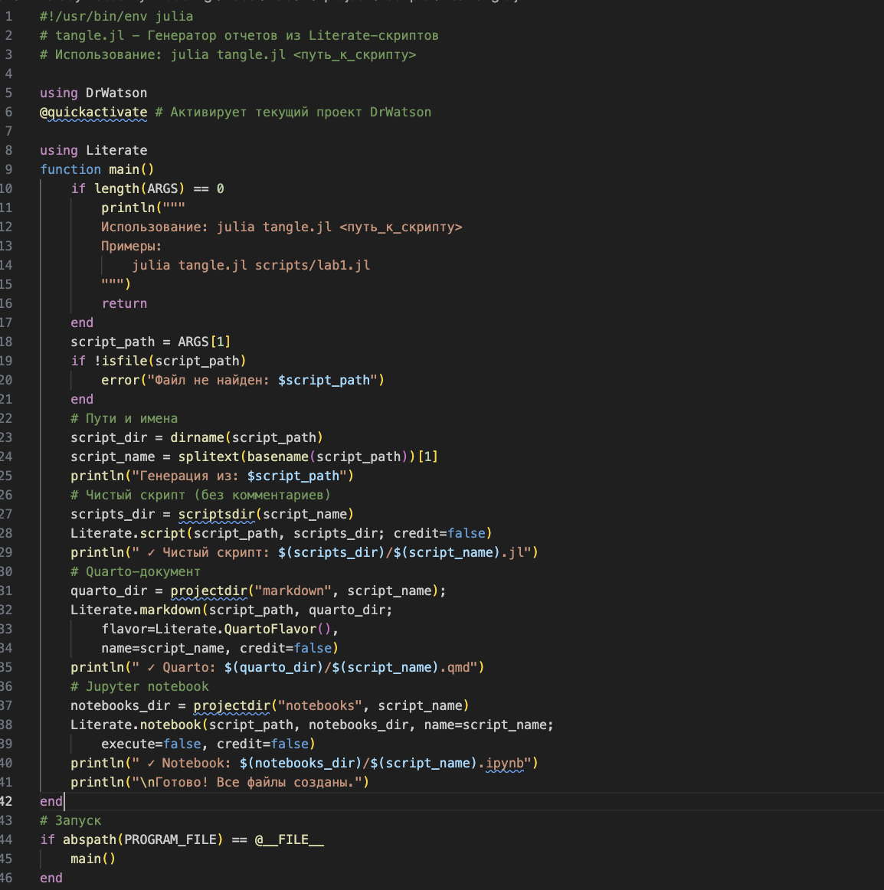
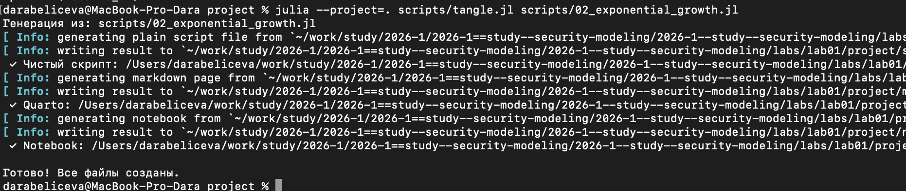

---
## Author
author:
  name: Ахлиддинзода Аслиддин
  degrees: BSc
  email: 1032259376@rudn.ru
  affiliation:
    - name: Российский университет дружбы народов
      country: Российская Федерация
      postal-code: 117198
      city: Москва
      address: ул. Миклухо-Маклая, д. 6

## Title
title: "Лабораторная работа №1"
subtitle: "Литературное программирование"
license: "CC BY"
---

# Цель работы

Изучить принципы воспроизводимых научных вычислений с использованием языка программирования Julia и пакетов DrWatson и Literate, а также освоить автоматическую генерацию различных форматов отчётов (скриптов, ноутбуков и документов Quarto) из единого исходного literate-скрипта.

# Задание

- Изучить структуру научного проекта, организованного с использованием пакета DrWatson.

- Освоить принципы literate-программирования, объединяющего программный код и документацию.

- Создать literate-скрипт, содержащий код модели и пояснения.

- Реализовать скрипт генерации производных форматов с использованием пакета Literate.

# Теоретическое введение

В современных научных исследованиях важным требованием является воспроизводимость результатов вычислений. Это означает, что любой исследователь должен иметь возможность повторить вычисления и получить те же результаты, используя исходный код и данные.

Одним из подходов к обеспечению воспроизводимости является literate-программирование. Данный подход предполагает объединение программного кода и текстового описания в одном документе. Это позволяет одновременно документировать алгоритм и реализовывать его программно. В языке Julia для этого используется пакет Literate.jl, который позволяет автоматически преобразовывать исходный literate-скрипт в различные форматы, такие как обычный скрипт, Jupyter notebook и документы Quarto[@julialang; @literatejl].

Для организации структуры научного проекта используется пакет DrWatson.jl. Он обеспечивает стандартизированную структуру каталогов проекта, управление зависимостями и упрощает воспроизводимость вычислений[@drwatsonjl].

Использование инструментов Literate и DrWatson позволяет автоматизировать процесс подготовки научных отчётов, обеспечить согласованность кода и документации, а также повысить прозрачность и воспроизводимость вычислительных экспериментов.

# Выполнение лабораторной работы

Создадим проект DrWatson для лабораторных. Для этого сначала установим необходимый пакет и инициализируем проект([рис. @fig-001]).

{#fig-001 width=70%}

Создадим файл add_packages.jlв корне проекта для добавления необходимых пакетов([рис. @fig-002], [рис. @fig-003]).

{#fig-002 width=70%}

{#fig-003 width=70%}

Создадим тестовый скрипт scripts/test_setup.jl для проверка установки([рис. @fig-004]).

{#fig-004 width=70%}

Итоговая структура проекта выглядит следующим образом([рис. @fig-005]).

{#fig-005 width=70%}

В качестве примера выполнения работы используем модель экспоненциального
роста. Создадим скрипт (scripts/01_exponential_growth.jl) и выполним его([рис. @fig-006]).

{#fig-006 width=70%}

Также создадим скрипт для генерации проивзодных форматов (scripts/tangle.jl)[рис. @fig-009]. В результате получим код оформленный в разных форматах([рис. @fig-010], [рис. @fig-011])

{#fig-009 width=70%}

{#fig-010 width=70%}

{#fig-011 width=70%}

Исследование не ограничивается одним значением параметров. Изменим программу так, чтобы она принимала набор параметров([рис. @fig-007], [рис. @fig-008]).

{#fig-007 width=70%}

{#fig-008 width=70%}





# Выводы

В результате работы были освоены принципы literate-программирования и воспроизводимых вычислений, а также реализована автоматическая генерация различных форматов отчётов из единого исходного Julia-скрипта с использованием пакетов DrWatson и Literate.

# Список литературы{.unnumbered}

::: {#refs}
:::
