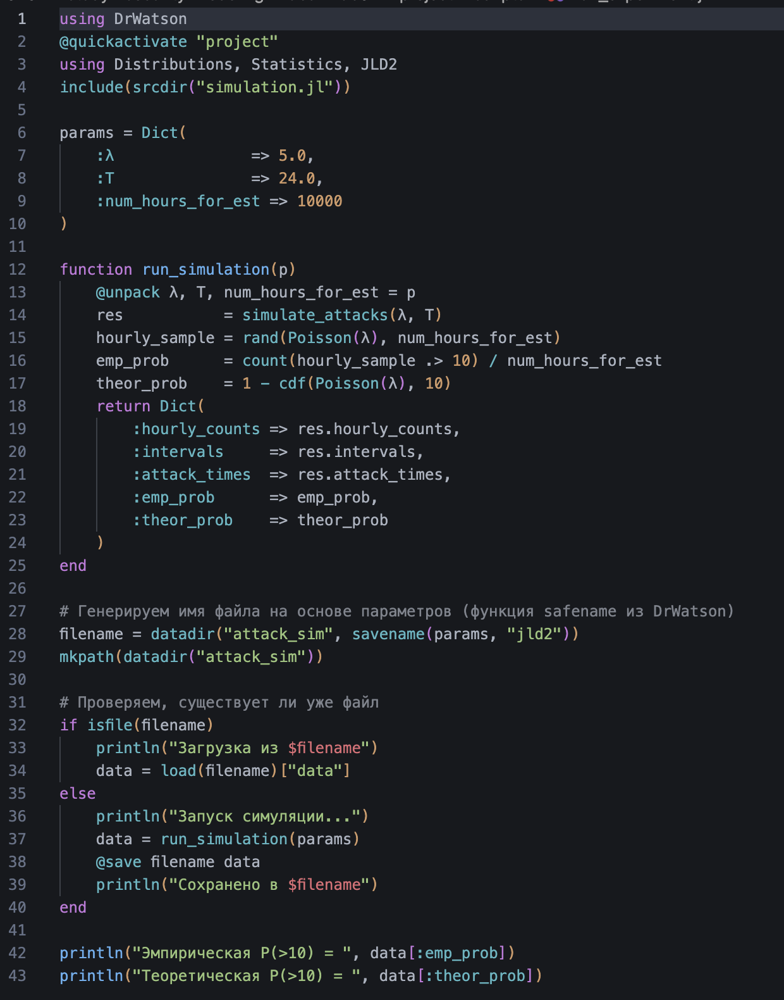
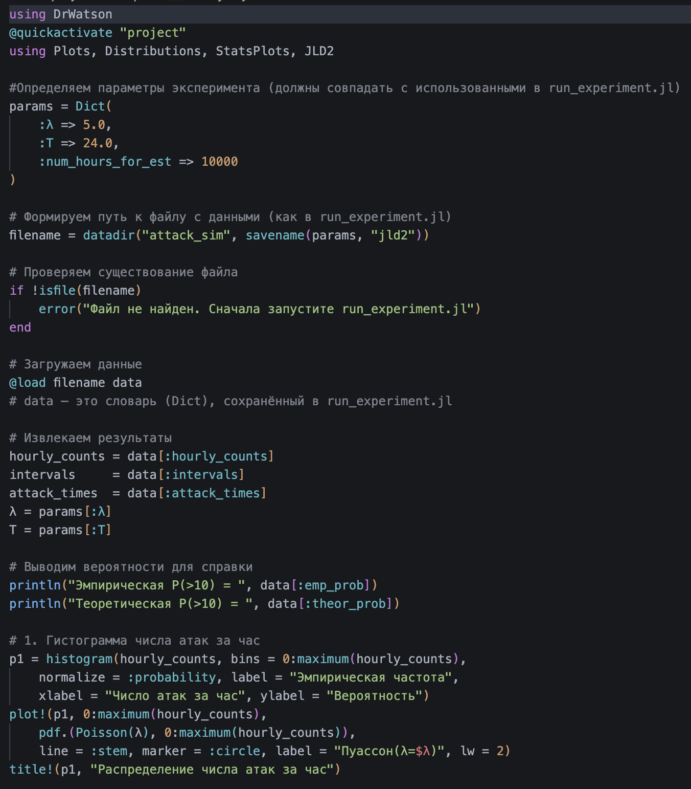
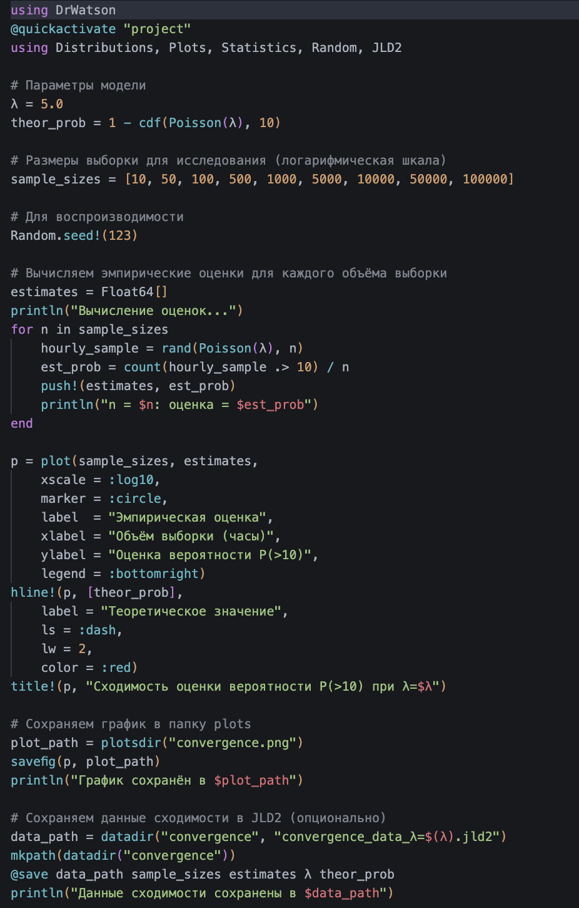
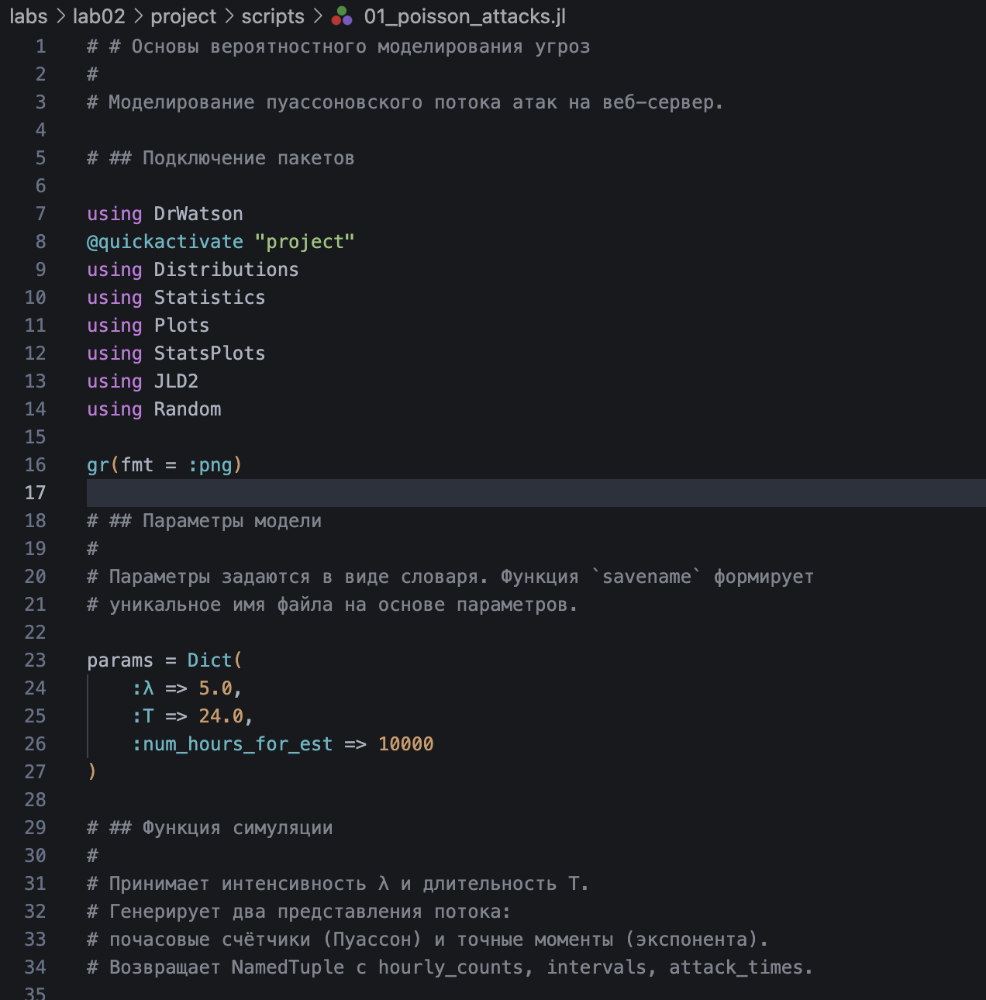
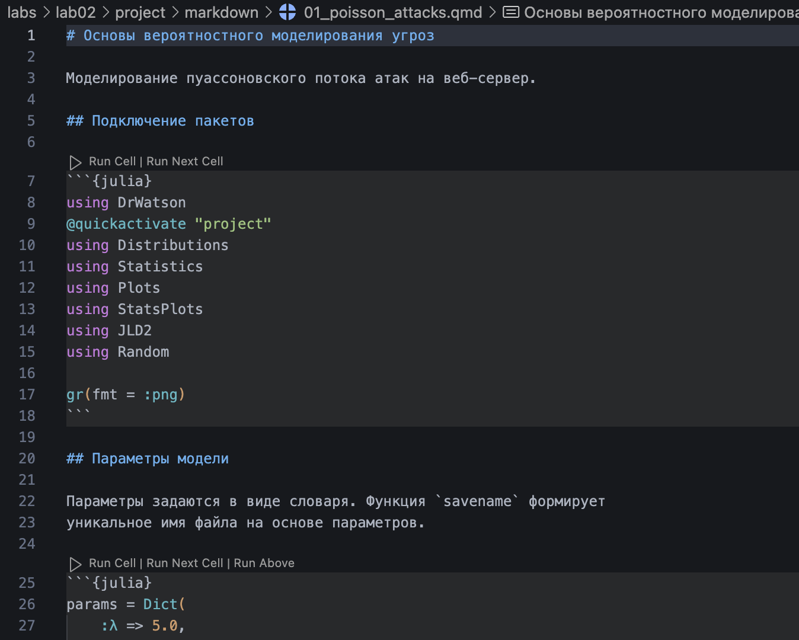
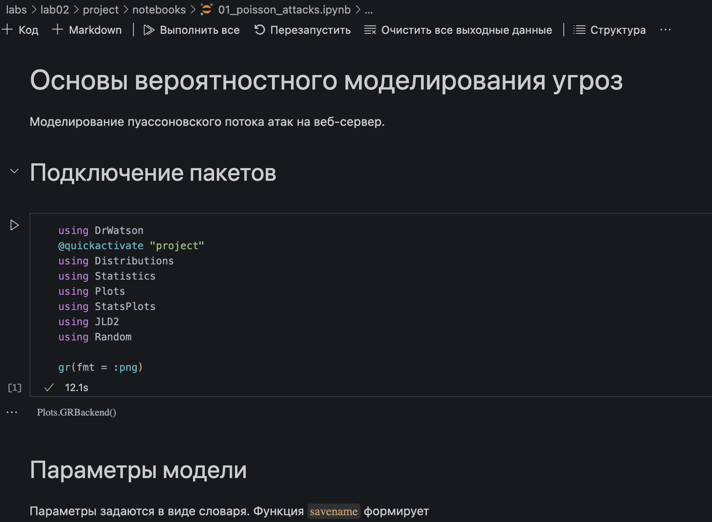
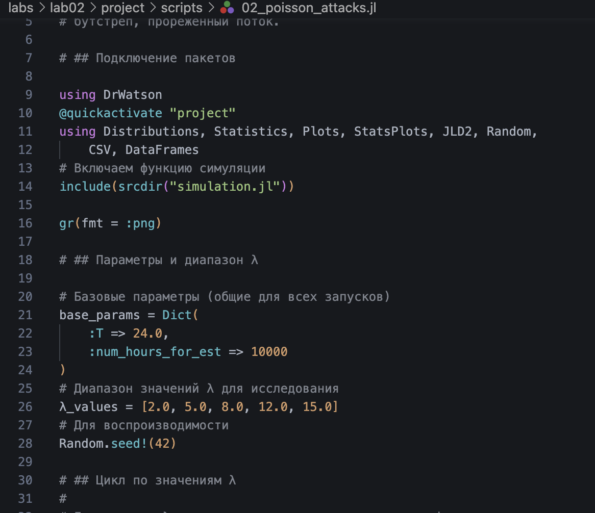
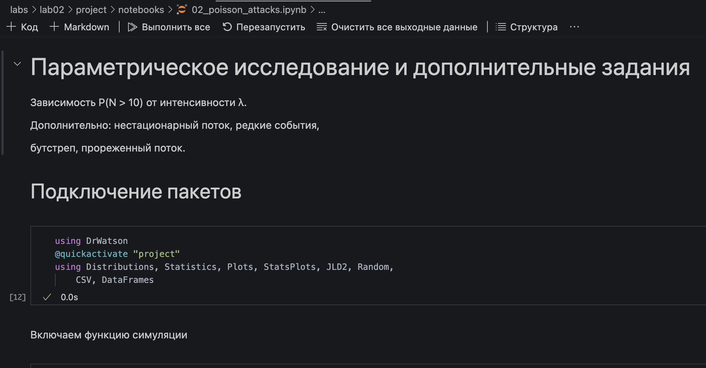
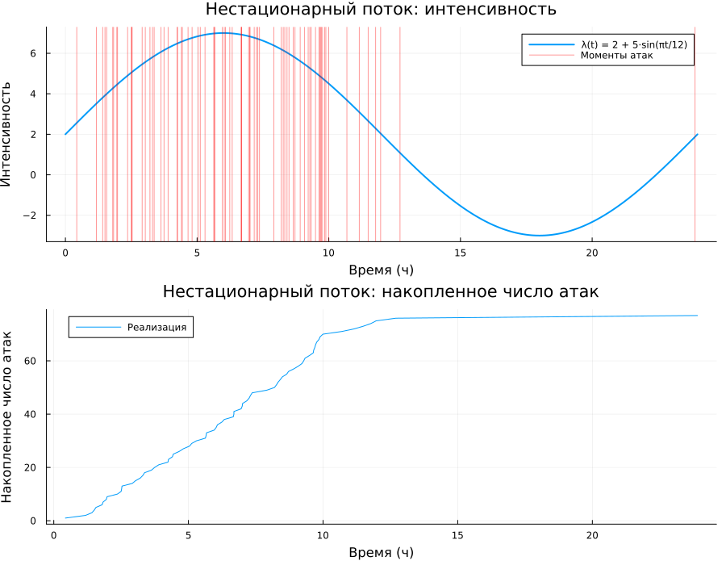
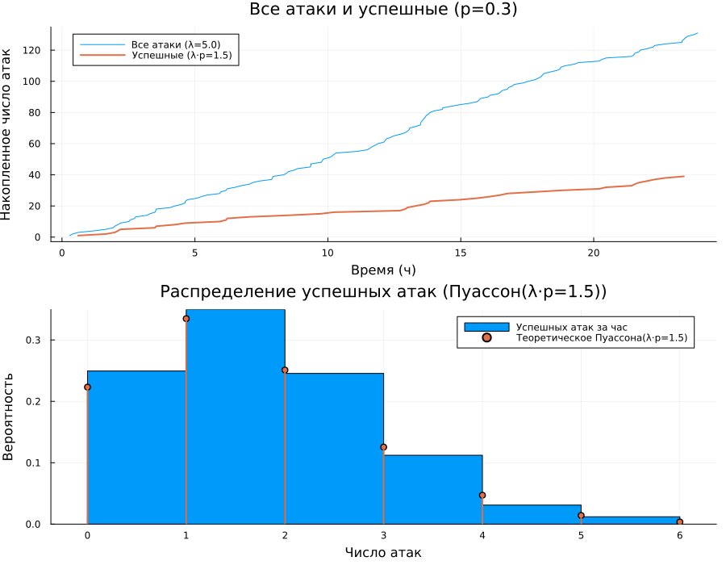

---
## Author
author:
  name: Ахлиддинзода Аслиддин
  degrees: MSc
  email: 1032259392@rudn.ru
  affiliation:
    - name: Российский университет дружбы народов
      country: Российская Федерация
      postal-code: 117198
      city: Москва
      address: ул. Миклухо-Маклая, д. 6
## Title
title: "Лабораторная работа №2"
subtitle: "Основы вероятностного моделирования угроз"
license: CC BY
date: today
date-format: "YYYY-MM-DD"
format:
  docx: default  # Сохранит как вордовский документ
  pdf: default   # Сохранит как PDF
---

# Информация

## Докладчик

:::::::::::::: {.columns align=center}
::: {.column width="70%"}

  * Ахлиддинзода Аслиддин
  * студент группы НФИмд-01-25
  * Российский университет дружбы народов
  * [1032259392@rudn.ru](mailto:1032259392@rudn.ru)
  * <https://github.com/aslidin12>

:::
::: {.column width="30%"}

:::
::::::::::::::

# Введение

## Цель работы

Освоить базовые методы вероятностного моделирования случайных процессов в контексте кибербезопасности на примере моделирования потока атак на веб-сервер.

# Задачи

- Реализовать симуляцию пуассоновского потока атак.

- Выполнить статистический анализ результатов:
  - гистограмма числа атак за час;
  - накопленное число атак;
  - проверка экспоненциальности интервалов (QQ-plot);
  - оценка вероятности P(>10 атак за час).

- Исследовать сходимость оценки вероятности от объёма выборки.

- Провести параметрическое исследование по λ.

- Преобразовать код в литературный стиль и сгенерировать производные форматы.
  
# Подготовка проекта

{#fig-001 width=65%}

# Подготовка проекта

{#fig-002 width=40%}

# Подготовка проекта

{#fig-003 width=50%}

# Подготовка проекта

{#fig-004 width=30%}

# Подготовка проекта

{#fig-005 width=30%}

# Моделирование пуассоновского потока

{#fig-006 width=45%}

# Генерация производных форматов

{#fig-009 width=45%}

# Генерация производных форматов

{#fig-007 width=50%}

# Генерация производных форматов

{#fig-008 width=55%}

# Параметрическая версия модели

{#fig-010 width=45%}

# Параметрическая версия модели

{#fig-011 width=70%}

# Дополнительные задания

{#fig-extra1 width=70%}

# Дополнительные задания

{#fig-extra2 width=60%}

# Дополнительные задания

{#fig-extra3 width=70%}

# Дополнительные задания

{#fig-extra4 width=70%}

# Дополнительные задания

{#fig-extra5 width=60%}

# Выводы

1. Сформирована структура рабочего пространства на основе DrWatson с разделением исходных кодов, данных и документации.

2. Реализована симуляция пуассоновского потока атак двумя способами: почасовые счётчики и точные моменты через экспоненциальные интервалы.

3. Выполнен статистический анализ: гистограммы, накопленный график, QQ-plot подтверждают соответствие теоретическим распределениям.

4. Проведено параметрическое исследование: при росте λ от 2 до 15 вероятность P(>10) возрастает от ~0 до ~0.88.

5. Исследована сходимость оценки вероятности редкого события: для надёжной оценки при λ=5 необходим объём выборки порядка 10 000–100 000 часов.

6. Из литературного кода автоматически сгенерированы три формата: чистый скрипт, Jupyter Notebook и документ Quarto.

# Список литературы

1. JuliaLang [Электронный ресурс]. 2024 JuliaLang.org contributors. URL: https: //julialang.org/ (дата обращения: 11.10.2024).
2. Julia 1.11 Documentation [Электронный ресурс]. 2024 JuliaLang.org contributors. URL: https://docs.julialang.org/en/v1/ (дата обращения: 11.10.2024).
3. Самарский А. А., Михайлов А. П. Математическое моделировамоделирование: Идеи. Методы. Примеры... — М.: Физматлит, 2001.. — 320 с. — ISBN 5-9221-0120-Х.
