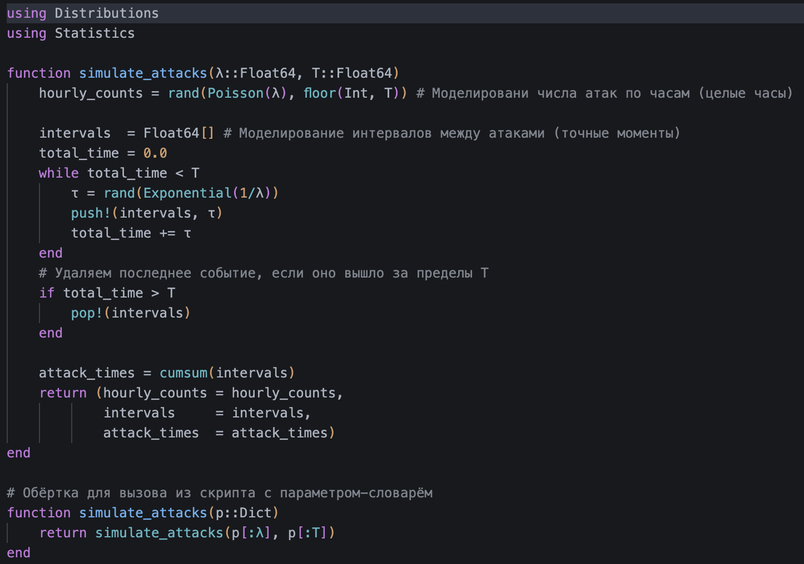
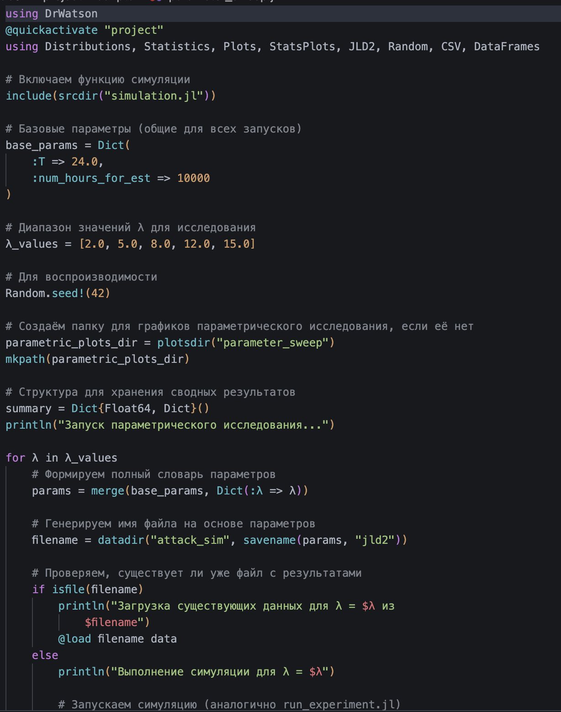
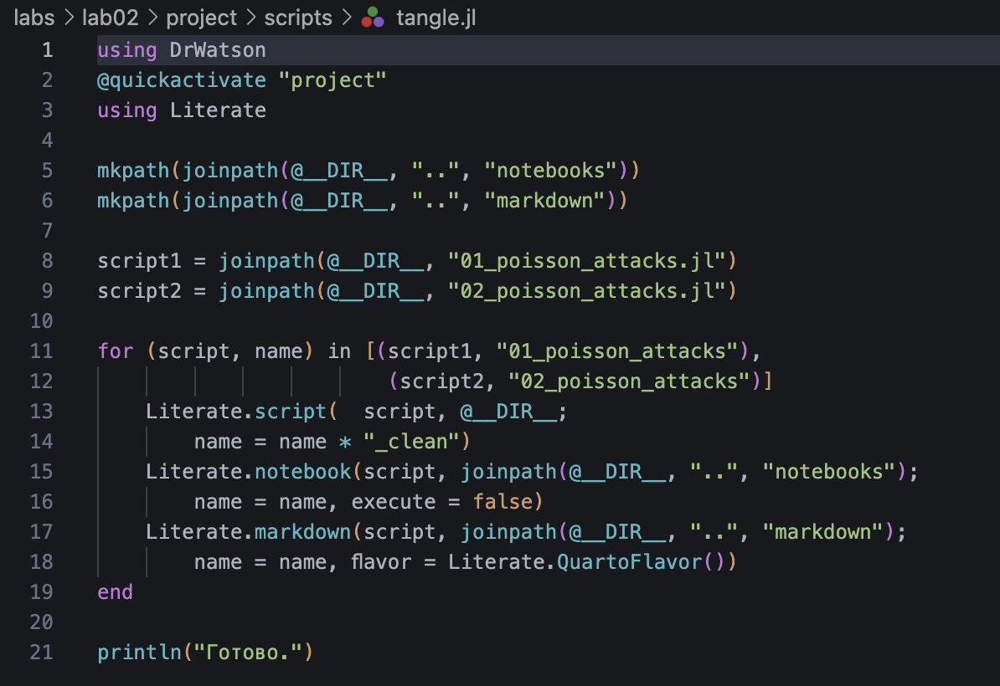
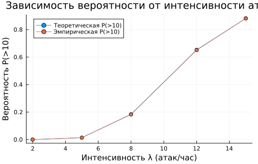
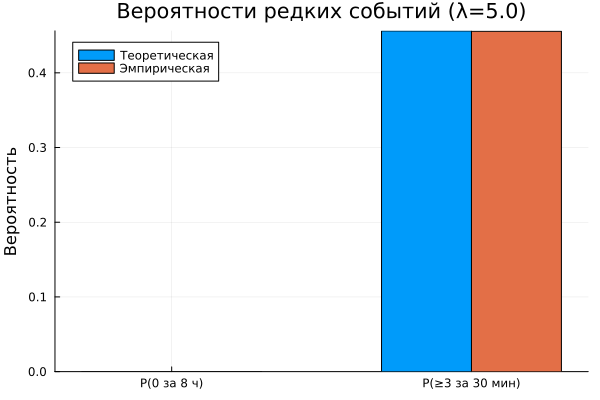
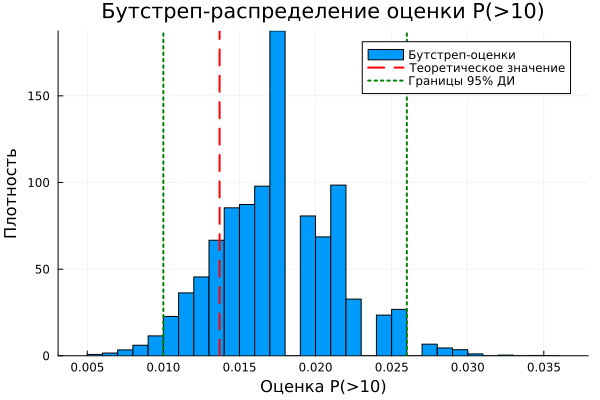

---
## Author
author:
  name: Ахлиддинзода Аслиддин
  degrees: MSc
  email: 1032259392@rudn.ru
  affiliation:
    - name: Российский университет дружбы народов
      country: Российская Федерация
      postal-code: 117198
      city: Москва
      address: ул. Миклухо-Маклая, д. 6

## Title
title: "Лабораторная работа №2"
subtitle: "Основы вероятностного моделирования угроз"
license: "CC BY"
---

# Цель работы

Освоить базовые методы вероятностного моделирования случайных процессов в контексте кибербезопасности.

На примере моделирования потока атак на веб-сервер изучить:

- генерацию случайных величин с заданным распределением;
- статистический анализ смоделированных данных;
- проверку соответствия эмпирического распределения теоретическому;
- оценку вероятностей редких событий;
- определить набор параметров модели (интенсивность атак, длительность наблюдения и т.д.);
- реализовать симуляцию пуассоновского потока атак;
- выполнить статистический анализ результатов;
- визуализировать данные и проверить соответствие теоретическим распределениям.

# Задание

1. Создать проект DrWatson с именем project.
2. Определить набор параметров модели (словарь params) с возможностью варьирования.
3. Написать функцию simulate_attacks(params), которая возвращает структуру с результатами симуляции (например, массив числа атак по часам, интервалы, моменты времени).
4. Использовать produce_or_load для запуска симуляции с заданными параметрами и сохранения результатов на диск.
5. Провести серию экспериментов с разными значениями параметров (например, разные $\lambda$, разная длительность).
6. Загрузить сохранённые результаты и выполнить:
   - построение гистограммы числа атак за час и сравнение с теоретическим распределением Пуассона;
   - построение графика накопленного числа атак и интервалов между атаками;
   - проверку экспоненциальности интервалов (гистограмма, QQ-plot, возможно критерий согласия);
   - оценку вероятности события «более 10 атак за час» теоретически и эмпирически.
7. Проанализировать зависимость точности оценки вероятности от числа симуляций.

Во многих задачах кибербезопасности поток атак (или инцидентов) можно приближённо считать простейшим (пуассоновским) потоком. Для такого потока число событий $N_t$ за время $t$ распределено по закону Пуассона:

$$P(N_t = k) = \frac{(\lambda t)^k}{k!} e^{-\lambda t}, \quad k = 0, 1, 2, \dots$$

где $\lambda$ — интенсивность потока (среднее число событий в единицу времени).

В простейшем потоке интервалы времени между соседними событиями $\tau_1, \tau_2, \dots$ независимы и имеют экспоненциальное распределение с параметром $\lambda$:

$$f(\tau) = \lambda e^{-\lambda \tau}, \quad \tau \geq 0$$

Среднее значение интервала: $\mathbb{E}[\tau] = 1/\lambda$.

# Выполнение лабораторной работы

Представленные скрипты образуют исследовательский конвейер:

- Моделирование (simulation.jl) — вычислительное ядро.
- Генерация данных (run_experiment.jl) — получение реализаций для фиксированных параметров.
- Анализ и визуализация (analyze.jl) — проверка соответствия модели теоретическим распределениям.
- Исследование сходимости (convergence.jl) — изучение точности оценок.
- Параметрическое исследование (parameter_sweep.jl) — анализ чувствительности к изменению интенсивности.

Для выполнения работы необходимо создать проект с помощью DrWatson. Затем создадим в этом проекте скрипт src/simulation.jl, который содержит функцию simulate_attacks, реализующую вероятностную модель потока атак ([рис. @fig-001]).

{#fig-001 width=70%}

Затем создадим скрипт scripts/run_experiment.jl. Он выполняет симуляцию с заданными параметрами, вычисляет эмпирическую вероятность события «более 10 атак за час» и сохраняет все результаты на диск ([рис. @fig-002]). Скрипт предназначен для первичной генерации данных, которые потом будут анализироваться в analyze.jl.

{#fig-002 width=70%}

Теперь создадим скрипт scripts/analyze.jl. Он загружает сохранённые данные и строит четыре диагностических графика, позволяющих визуально оценить соответствие смоделированного потока теоретическим предположениям (пуассоновости и экспоненциальности) ([рис. @fig-003]).

{#fig-003 width=70%}

Также добавим скрипт scripts/convergence.jl ([рис. @fig-004]). Он позволяет изучить, как быстро эмпирическая оценка вероятности редкого события приближается к теоретическому значению при увеличении объёма выборки.

{#fig-004 width=70%}

Создадим скрипт scripts/parameter_sweep.jl ([рис. @fig-005]). Позволяет систематически изучить, как изменение интенсивности атак влияет на характеристики потока и, в частности, на вероятность P(>10).

{#fig-005 width=70%}

Создадим литературный скрипт scripts/01_poisson_attacks.jl ([рис. @fig-006]). Он объединяет весь код конвейера в одном файле с markdown-комментариями в формате Literate.jl.

{#fig-006 width=70%}

Также создадим скрипт для генерации производных форматов scripts/tangle.jl ([рис. @fig-009]). В результате получим код, оформленный в разных форматах ([рис. @fig-007], [рис. @fig-008]).

{#fig-007 width=70%}

{#fig-008 width=70%}

{#fig-009 width=70%}

Исследование не ограничивается одним значением параметров. Создадим литературный скрипт scripts/02_poisson_attacks.jl ([рис. @fig-010]), содержащий параметрическое исследование по λ и дополнительные задания. В результате получим notebook с параметрами ([рис. @fig-011]).

{#fig-010 width=70%}

{#fig-011 width=70%}

# Контрольные вопросы

**1. Какими свойствами обладает простейший поток событий? Почему он часто используется для моделирования атак?**

Простейший (пуассоновский) поток обладает тремя свойствами:

1. **Стационарность** — вероятность появления $k$ событий за интервал длины $t$ зависит только от $t$ и не зависит от момента начала отсчёта.
2. **Отсутствие последействия** — число событий в непересекающихся интервалах независимо.
3. **Ординарность** — вероятность появления двух и более событий за бесконечно малый интервал пренебрежимо мала.

Используется для моделирования атак потому что это математически простой и хорошо изученный процесс с готовыми аналитическими формулами. Согласно теореме Пальма–Хинчина, суперпозиция большого числа независимых стационарных ординарных потоков сходится к пуассоновскому — что соответствует реальной ситуации, когда атаки приходят от множества независимых источников.

**2. Как сгенерировать реализацию пуассоновского потока на интервале времени?**

Используется метод на основе экспоненциального распределения интервалов. Алгоритм:

1. Задать интенсивность λ и длительность T.
2. Установить t = 0.
3. Генерировать τ ~ Exp(λ), прибавлять к t.
4. Если t ≤ T — записать момент события, иначе — остановиться.

**3. Как проверить, что интервалы между событиями распределены экспоненциально?**

Три способа:

- **Гистограмма с теоретической плотностью** — строим гистограмму интервалов и накладываем кривую Exp(λ). Если совпадают — распределение экспоненциальное.
- **QQ-plot** — строим квантиль-квантильный график интервалов против теоретического экспоненциального распределения. В нашем коде это `qqplot(Exponential(1/λ), intervals, qqline = :identity)`. Если точки лежат на прямой y = x — распределение экспоненциальное.
- **Критерий Колмогорова–Смирнова** — если p-value > 0.05, нет оснований отвергать гипотезу об экспоненциальности.

**4. В чём преимущества использования DrWatson для организации вычислительного эксперимента?**

- **Стандартная структура проекта** — папки `src/`, `scripts/`, `data/`, `plots/` создаются автоматически.
- **Воспроизводимость** — проект инициализируется как Julia-окружение с `Project.toml` и `Manifest.toml`, фиксируя версии всех пакетов.
- **`@quickactivate`** — макрос гарантирует что скрипт выполняется в контексте именно этого проекта.
- **`savename`** — автоматически формирует имя файла из словаря параметров, исключая путаницу между результатами разных запусков.
- **Кэширование** — `produce_or_load` не пересчитывает результаты если файл уже существует.

**5. Что такое `produce_or_load` и как он работает?**

`produce_or_load` — функция DrWatson для кэширования результатов вычислений. Логика работы:

1. Формирует путь к файлу на основе параметров через `savename`.
2. Если файл существует — загружает данные с диска, вычисление не запускается.
3. Если файла нет — выполняет вычисление и сохраняет результат.

В нашей лабе реализована та же логика вручную через `isfile` + `@save`/`@load`, что эквивалентно `produce_or_load`.

**6. Какая структура проекта создаётся DrWatson? Для чего нужны папки?**

```
project/
├── data/         # результаты симуляций, сохранённые JLD2/CSV файлы
├── scripts/      # запускаемые скрипты
├── src/          # исходный код — функции и модули
├── plots/        # сохранённые графики
├── notebooks/    # Jupyter notebooks
├── markdown/     # Quarto-документация
├── Project.toml  # список зависимостей проекта
└── Manifest.toml # зафиксированные версии всех пакетов
```

`src/` — переиспользуемый код, подключается через `include(srcdir(...))`. `scripts/` — точки входа, запускаются напрямую. `data/` — только результаты, не редактируется вручную. `plots/` — только графики, генерируются скриптами.

**7. Как задать набор параметров для множественных запусков в DrWatson?**

Вынести параметры в отдельный файл `scripts/params.jl`:

```julia
default_params = Dict(
    :λ => 5.0,
    :T => 24.0,
    :num_hours_for_est => 10000
)
```

В других скриптах подключать и переопределять нужные поля через `merge`. Для множественных запусков — создавать список словарей и итерировать по нему, как реализовано в `parameter_sweep.jl` через цикл по `λ_values`.

## Дополнительные задания

**Задание 1.** Изменим интенсивность λ и сравним результаты. Данное задание выполнено в скрипте `scripts/parameter_sweep.jl` — там рассматриваются значения λ ∈ {2.0, 5.0, 8.0, 12.0, 15.0}. Для каждого значения в папке `plots/parameter_sweep/` сохраняются детальные графики `attack_sim_λ=2.0.png`, `attack_sim_λ=5.0.png`, `attack_sim_λ=8.0.png`, `attack_sim_λ=12.0.png`, `attack_sim_λ=15.0.png` — каждый содержит сетку 2×2 из гистограммы числа атак, накопленного числа атак, гистограммы интервалов и QQ-plot. Сводный график зависимости P(>10) от λ сохраняется в `plots/parameter_sweep.png` ([рис. @fig-extra1]).

По результатам:

- При λ=2 распределение числа атак сдвинуто влево — пик около 1-2 атак за час, эмпирическая гистограмма хорошо совпадает с теоретическим Пуассоном(2). Интервалы между атаками большие — около 0.3-2 ч. Вероятность P(>10) близка к нулю (~8.3·10⁻⁶).
- При λ=8 распределение смещается вправо — пик около 7-8 атак за час, интервалы короткие — большинство менее 0.2 ч. Вероятность P(>10) резко возрастает (~0.184).
- При λ=12 пик распределения около 10 атак за час, интервалы очень короткие — менее 0.1 ч. Вероятность P(>10) превышает 0.65.
- При λ=15 вероятность достигает ~0.88 — более 10 атак за час почти гарантировано.
- Теоретическая и эмпирическая кривые совпадают во всём диапазоне λ, что подтверждает корректность симуляции.

{#fig-extra1 width=70%}

**Задание 2.** Смоделируем нестационарный пуассоновский поток с интенсивностью λ(t) = 2 + 5·sin(πt/12). Для этого используем метод прореживания: генерируем однородный поток с верхней границей λ_max = 7, затем каждое событие в момент t принимаем с вероятностью λ(t)/λ_max. Результаты сохраняются в `plots/nonstationary_flow.png` ([рис. @fig-extra2]).

По результатам:

- На верхнем графике видно что атаки сконцентрированы в промежутке 4-10 ч когда λ(t) максимальна. После 10 ч атак практически нет.
- На нижнем графике накопленный рост резко замедляется после 10 ч и практически останавливается — все ~70 атак произошли в первой половине суток.
- Метод прореживания корректно воспроизводит нестационарность — плотность моментов атак соответствует форме λ(t).

{#fig-extra2 width=70%}

**Задание 3.** Исследуем вероятности двух редких событий: «ни одной атаки за смену (8 часов)» и «не менее 3 атак за 30 минут». Для каждого события вычислим теоретическую вероятность через формулу Пуассона и эмпирическую по выборке из 100 000 наблюдений. Результаты сохраняются в `plots/rare_events.png` ([рис. @fig-extra3]).

По результатам (λ = 5):

- P(0 за 8 ч) теоретически = 4.25·10⁻¹⁸ — число настолько малое что эмпирически из 100 000 наблюдений ни разу не встретилось (эмпирическая = 0.0). На графике столбцы для этого события не видны.
- P(≥3 за 30 мин) теоретически = 0.4562, эмпирически = 0.4534 — значения практически совпадают, расхождение менее 0.3%. На графике оба столбца одинаковой высоты около 0.456.

{#fig-extra3 width=70%}

**Задание 4.** Оценим доверительный интервал для вероятности события «более 10 атак за час» методом бутстрепа. Метод состоит в многократном пересэмплировании исходной выборки с возвращением: для каждой бутстреп-выборки вычисляется оценка вероятности, после чего из распределения этих оценок извлекаются квантили 0.025 и 0.975, образующие 95% доверительный интервал. Результаты сохраняются в `plots/bootstrap_ci.png` ([рис. @fig-extra4]).

По результатам (λ = 5, N = 1000, B = 10000):

- Бутстреп-распределение оценок P(>10) сосредоточено в диапазоне 0.005–0.035, пик около 0.017.
- Теоретическое значение ≈ 0.0137 находится в левой части распределения.
- Границы 95% ДИ — примерно [0.010, 0.026]. Широкий интервал говорит о недостаточной точности при N=1000 для оценки редкого события, что согласуется с результатами convergence.jl.
- Теоретическое значение попадает внутрь 95% ДИ — метод бутстрепа работает корректно.

{#fig-extra4 width=70%}

**Задание 5.** Добавим в модель вероятность успешности атаки p = 0.3. Согласно теореме о прореживании пуассоновского потока, успешные атаки сами образуют пуассоновский поток с интенсивностью λ·p = 5·0.3 = 1.5. Результаты сохраняются в `plots/thinned_flow.png` ([рис. @fig-extra5]).

По результатам:

- Синяя линия (все атаки, λ=5) достигает ~125 атак за 24 ч, оранжевая линия (успешные, λ·p=1.5) — ~40 атак. Отношение примерно 3:1, что точно соответствует p=0.3.
- Оба графика линейные с постоянным наклоном — оба потока однородные пуассоновские, что подтверждает теорему о прореживании.
- Гистограмма успешных атак за час хорошо совпадает с теоретическим Пуассоном(1.5) — пик на 1 атаке (~0.335).

{#fig-extra5 width=70%}





# Выводы

1. Сформирована структура рабочего пространства на основе DrWatson, обеспечивающая разделение исходных кодов, данных и документации.
2. Реализована симуляция пуассоновского потока атак двумя способами: почасовые счётчики из распределения Пуассона и точные моменты через экспоненциальные интервалы.
3. Выполнен статистический анализ результатов: гистограммы, накопленный график, QQ-plot — все подтверждают соответствие теоретическим распределениям.
4. Проведено параметрическое исследование: показана зависимость P(>10) от интенсивности λ — при росте λ от 2 до 15 вероятность возрастает от ~0 до ~0.88.
5. Исследована сходимость оценки вероятности редкого события: для надёжной оценки P(>10) при λ=5 необходим объём выборки порядка 10 000–100 000 часов.
6. Выполнена интеграция вычислительных экспериментов с их описанием за счёт преобразования кода в литературный стиль.
7. Автоматизирована генерация артефактов (чистый код, Notebook, отчёт Quarto), что повышает воспроизводимость исследования.

# Список литературы{.unnumbered}

::: {#refs}
:::
