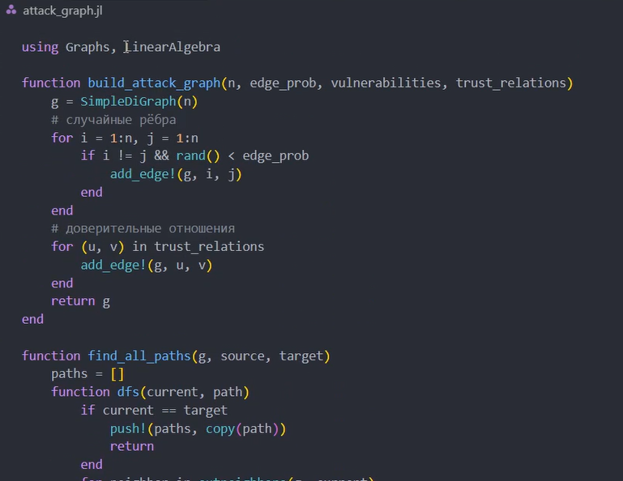
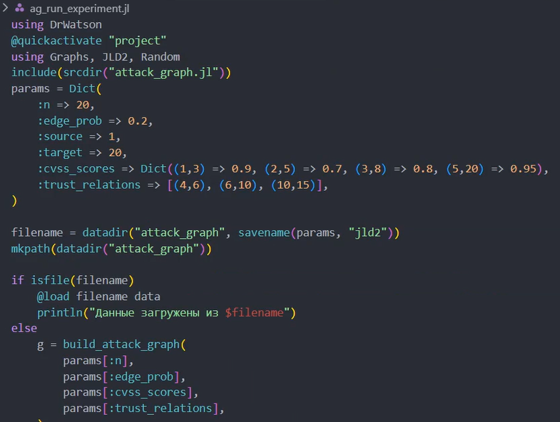
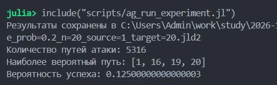
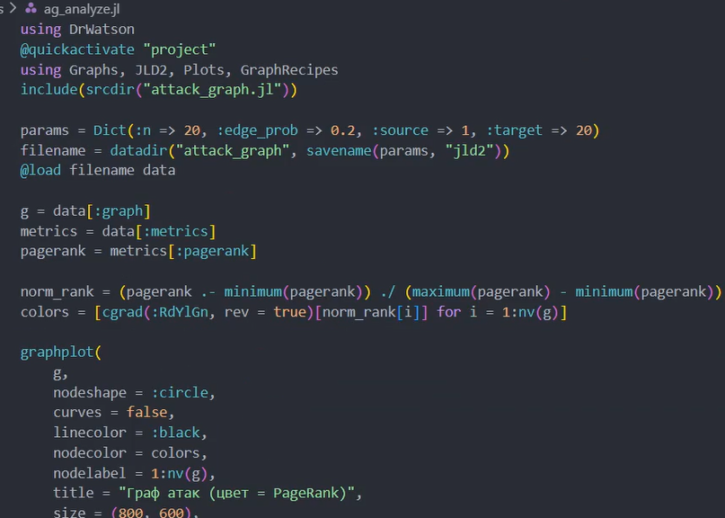
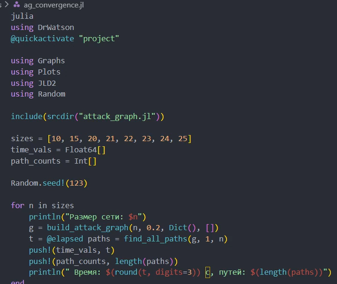
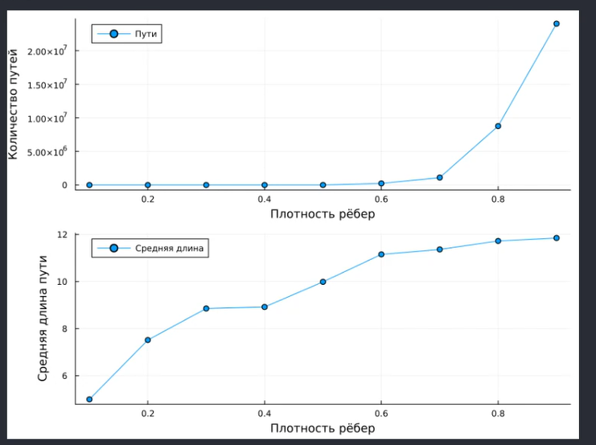
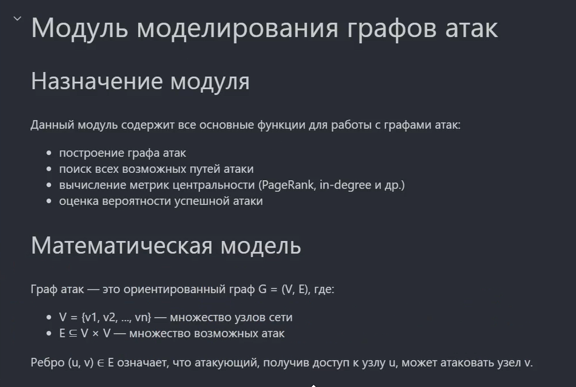
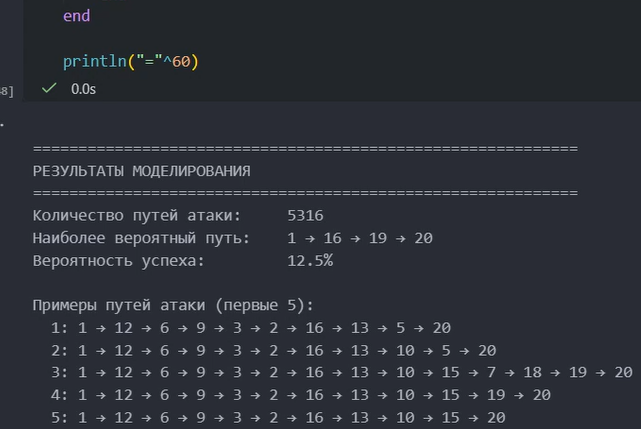

---
## Author
author:
  name: Ахлиддинзода Аслиддин
  degrees: DSc
  orcid: 0000-0000-0000-0000
  email: 1032259392@rudn.ru
  affiliation:
    - name: Российский университет дружбы народов
      country: Российская Федерация
      postal-code: 117198
      city: Москва
      address: ул. Миклухо-Маклая, д. 6
## Title
title: Лабораторная работа №3
subtitle: Моделирование графов атак
license: CC BY
date: Ахлиддинзода Аслиддин
date-format: "2026-04-03" # Example: 2025-09-06
---
# Информация

## Докладчик

:::::::::::::: {.columns align=center}
::: {.column width="70%"}

* Ахлиддинзода Аслиддин
* НФИмд-01-25
* студент кафедры теории вероятностей и кибербезопасности
* Российский университет дружбы народов им. П. Лумумбы
* 1032259392@rudn.ru
* https://github.com/artyombabenko

:::
::: {.column width="30%"}

:::
::::::::::::::

# Цель работы

— Освоить анализ графов атак для оценки уязвимостей сетевой инфраструктуры.

— На примере атак на корпоративную сеть изучить: представление топологии и уязвимостей в виде графа; алгоритмы поиска путей атаки; расчёт метрик центральности для выявления критических узлов; визуализацию графа с цветовой индикацией риска; оценку вероятности успешной атаки с учётом сложности уязвимостей.

# Задание

— Создать рабочий каталог для кода. Установить необходимые пакеты.

— Выполнить предложенный код. Преобразовать код в литературный стиль.

— Сгенерировать из литературного кода: чистый код; jupyter notebook; документацию в формате Quarto.

— Выполнить код из jupyter notebook. Интегрировать документацию в формате Quarto в отчёт.

— Добавить в код в литературном стиле вычисление для набора параметров. Сгенерировать из литературного кода с параметрами: чистый код; jupyter notebook; документацию в формате Quarto.

# Ход работы

{#fig-001 width="70%"}

# Выполнение кода

{#fig-002 width="70%"}

# Выполнение кода

{#fig-003 width="70%"}

# Выполнение кода

{#fig-004 width="70%"}

# Выполнение кода

{#fig-005 width="70%"}

# Выполнение кода

{#fig-006 width="70%"}

# Выполнение кода

{#fig-007 width="70%"}

# Выполнение кода

{#fig-008 width="70%"}

# Выполнение кода

{#fig-009 width="70%"}

# Выполнение кода

{#fig-010 width="70%"}

# Преобразование кода

{#fig-011 width="70%"}

# Преобразование кода

{#fig-012 width="70%"}

# Преобразование кода

{#fig-013 width="70%"}

# Преобразование кода

{#fig-014 width="70%"}

# Изменение кода

{#fig-015 width="70%"}

# Изменение кода

{#fig-016 width="70%"}

# Выводы

В ходе выполнения лабораторной работы я успешно освоил методы построения и анализа графов атак для оценки уязвимостей сетевой инфраструктуры, смоделировал атаки на корпоративную сеть.
