---
## Author
author:
  name: Ахлиддинзода Аслиддин
  degrees: DSc
  orcid: 0000-0002-0877-7063
  email: 1032259392@rudn.ru
  affiliation:
    - name: Российский университет дружбы народов
      country: Российская Федерация
      postal-code: 117198
      city: Москва
      address: ул. Миклухо-Маклая, д. 6

## Title
title: Лабораторная работа №2 "Моделирование графов атак"
subtitle: Бабенко Артём Сергеевич
license: "CC BY"
---

# Цель работы

— Освоить методы построения и анализа графов атак для оценки уязвимостей сетевой инфраструктуры. 
— На примере моделирования атак на корпоративную сеть изучить: 
—— представление сетевой топологии и уязвимостей в виде ориентированного графа; 
—— алгоритмы поиска всех возможных путей атаки от начальных точек до целевых активов; 
—— расчёт метрик центральности для определения критических узлов; 
—— визуализацию графа с цветовой индикацией уровня риска; 
—— оценку вероятности успешной атаки с учётом сложности эксплуатации уязвимостей.

# Задание

— Построить граф атак для заданной топологии сети. — Реализовать алгоритм поиска всех путей от заданного источника к цели. — Рассчитать метрики центральности для всех узлов и выявить наиболее критичные. — Визуализировать граф, раскрашивая узлы в зависимости от степени риска. — Присвоить каждому ребру вес (вероятность успешной атаки) и вычислить наиболее вероятный путь атаки.

— Создать рабочий каталог для кода. — Установить необходимые пакеты. — Выполнить предложенный код. — Преобразовать код в литературный стиль. — Сгенерировать из литературного кода: чистый код; jupyter notebook; документацию в формате Quarto. — Выполнить код из jupyter notebook. — Интегрировать документацию в формате Quarto в отчёт. — Добавить в код в литературном стиле вычисление для набора параметров. — Сгенерировать из литературного кода с параметрами: чистый код; jupyter notebook; документацию в формате Quarto. — Выполнить код из jupyter notebook с параметрами. — Интегрировать документацию с параметрами в формате Quarto в отчёт.

# Теоретическое введение

Граф атак (Attack Graph) есть ориентированный граф, в котором вершины представляют состояния системы (например, узлы сети, привилегии, факты), а рёбра — действия, которые может выполнить атакующий для перехода из одного состояния в другое. Часто используют двудольный граф. Вершины делятся на узлы сети и условия, а рёбра показывают зависимости. В упрощённой модели граф атак можно представить как ориентированный граф, где: — вершины суть сетевые узлы (хост, сервер, рабочая станция); — направленные рёбра суть возможность атаки с одного узла на другой (например, через эксплойт уязвимости, доверительные отношения, сетевой доступ). Для каждого узла можно задать: — уровень защищённости (security level); — список уязвимостей (CVE); — тип узла (сервер, клиент, маршрутизатор). Задача анализа графа атак часто сводится к нахождению всех путей от источника (злоумышленник) к цели (критический актив). Для этого применяются: — алгоритм поиска в глубину (DFS) или в ширину (BFS); — алгоритм Дейкстры для поиска наименее сложного пути (если рёбра имеют веса, например, сложность эксплуатации). В графах атак для выявления наиболее критичных узлов используются метрики центральности. — Степень центральности (degree centrality) — количество инцидентных рёбер. Для ориентированных графов — in-degree (количество атак, ведущих к узлу) и out-degree (количество атак, исходящих из узла). — Центральность по посредничеству (betweenness centrality) — доля кратчайших путей, проходящих через узел. — Центральность по близости (closeness centrality) — обратное среднее расстояние до всех других узлов. — PageRank — мера важности узла, учитывающая важность узлов, ссылающихся на него. Если каждому ребру присвоить вероятность успешной эксплуатации, то вероятность успешной атаки по определённому пути вычисляется как произведение вероятностей рёбер. Общая вероятность успеха атаки на цель максимальна среди всех путей.

# Выполнение лабораторной работы

## Подготовка каталога
Я создал рабочий каталог для кода. 

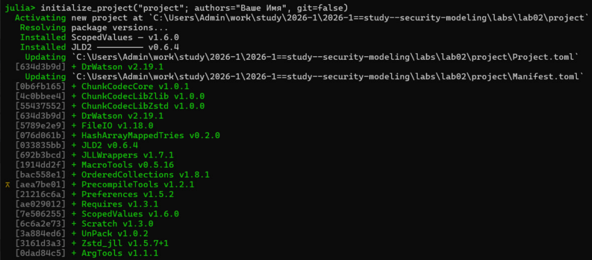{#fig-001 width="70%"}

Содержимое каталога.

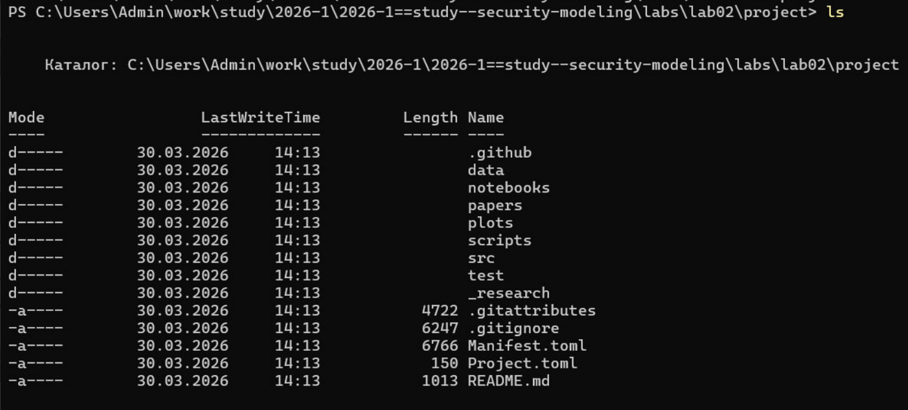{#fig-001 width="70%"}

Устанавливаем необходимые пакеты

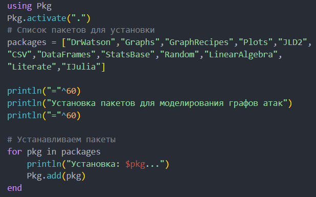{#fig-001 width="70%"}

## Выполнение кода

Выполняем предложенный код.
src/attack_graph.jl содержит все функции для построения ориентированного графа атак, поиска
путей, расчёта метрик центральности, присвоения весов и нахождения наиболее
вероятного пути. Это основной модуль, используемый всеми скриптами.

{#fig-001 width="70%"}


scripts/ag_run_experiment.jl выполняет построение графа атак для заданных параметров, находит все пути, вычисляет метрики центральности, определяет наиболее вероятный путь и сохраняет результаты в JLD2-файл. Предназначен для генерации данных, которые будут анализироваться в других скриптах.

{#fig-001 width="70%"}

{#fig-001 width="70%"}


scripts/ag_analyze.jl загружает сохранённые данные. Строит наглядное изображение графа (с цветовой индикацией по PageRank). Выводит статистику: количество узлов, рёбер, пути, топ-5 критичных узлов по in-degree и PageRank.

{#fig-001 width="70%"}

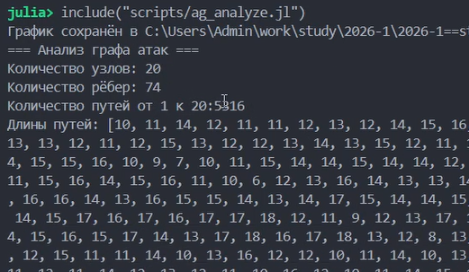{#fig-001 width="70%"}

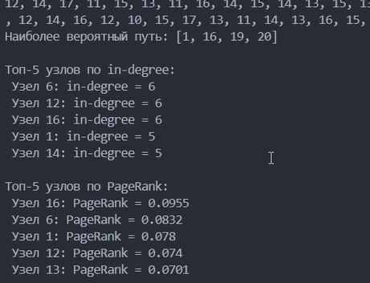{#fig-001 width="70%"}

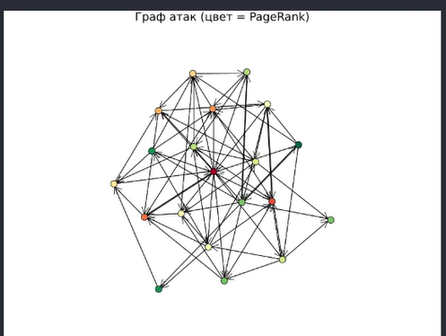{#fig-001 width="70%"}


scripts/ag_convergence.jl исследование, как размер сети (число узлов) влияет на время поиска всех путей и на количество найденных путей. Позволяет оценить вычислительную сложность алгоритма.

{#fig-001 width="70%"}

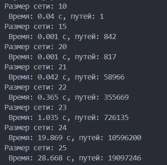{#fig-001 width="70%"}

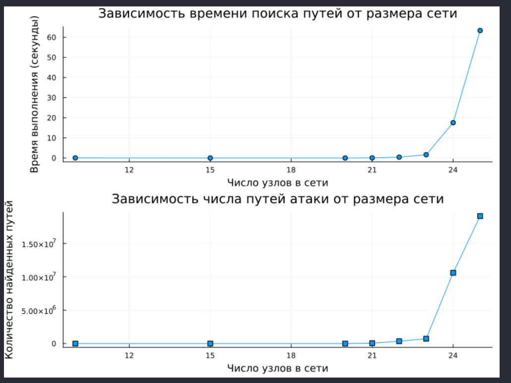{#fig-001 width="70%"}


scripts/parameter_sweep.jl изучает, как изменение плотности рёбер (вероятности случайного ребра) влияет на количество путей атаки, максимальную входящую степень и среднюю длину пути.

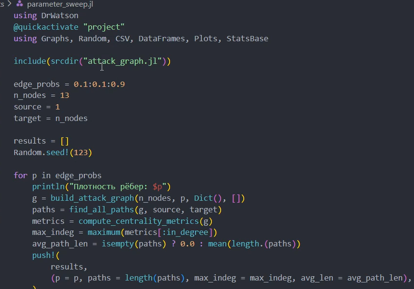{#fig-001 width="70%"}

{#fig-001 width="70%"}

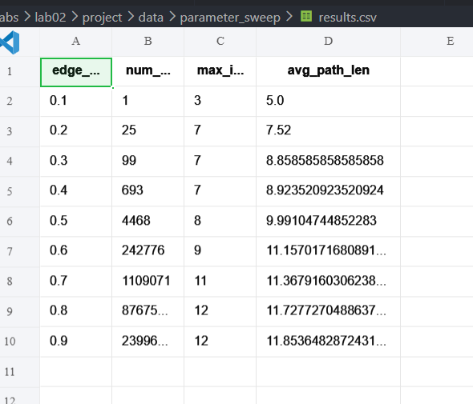{#fig-001 width="70%"}


## Преобразование кода

Затем преобразовал весь код в литературный стиль

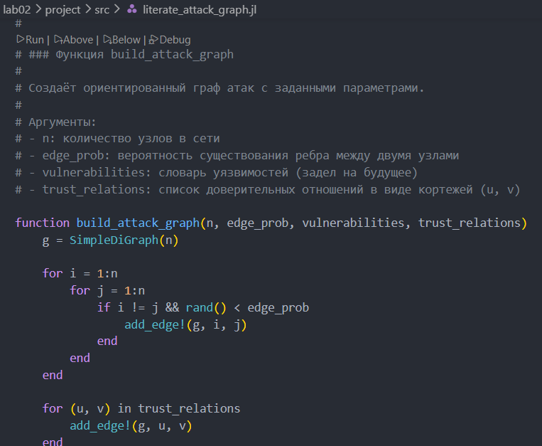{#fig-001 width="70%"}


Далее сгенерировал из литературного кода чистый код, jupyter notebook, документацию в формате Quarto.

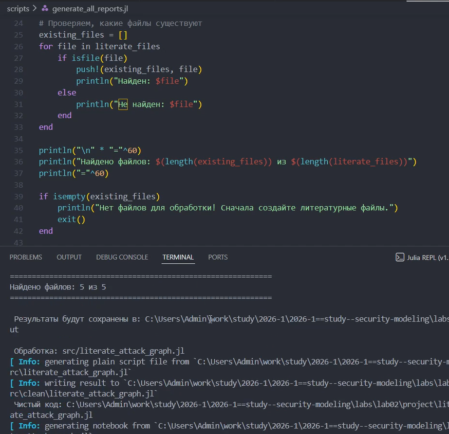{#fig-001 width="70%"}

Выполнил код из Jupiter Notebook

{#fig-001 width="70%"}

{#fig-001 width="70%"}


Интегрировал документацию в формате Quarto в отчёт.

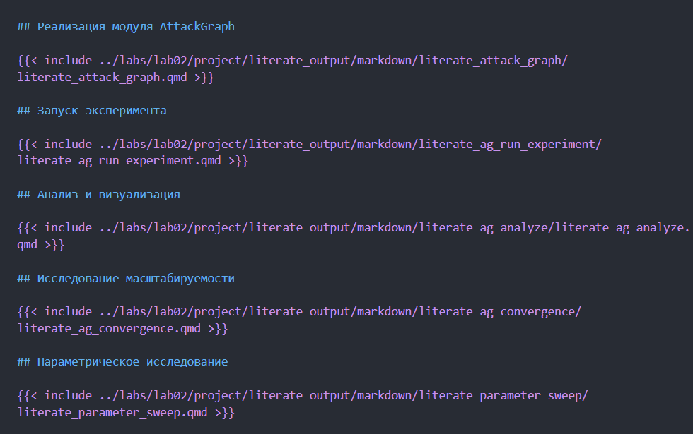{#fig-001 width="70%"}


## Изменение кода
Затем я добавил в код в литературном стиле вычисление для набора параметров

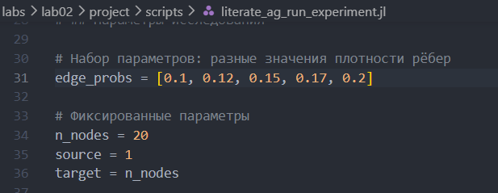{#fig-001 width="70%"}

Сгенерировал из литературного кода с параметрами чистый код, jupyter notebook, документацию в формате Quarto.


Выполнил код из Jupiter Notebook

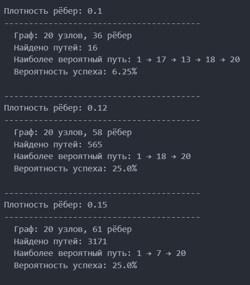{#fig-001 width="70%"}

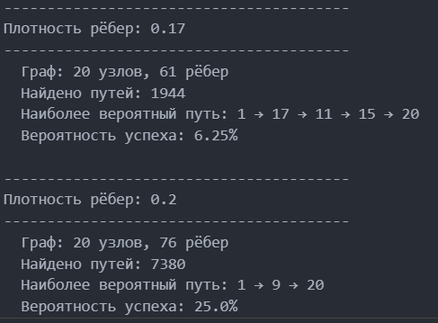{#fig-001 width="70%"}

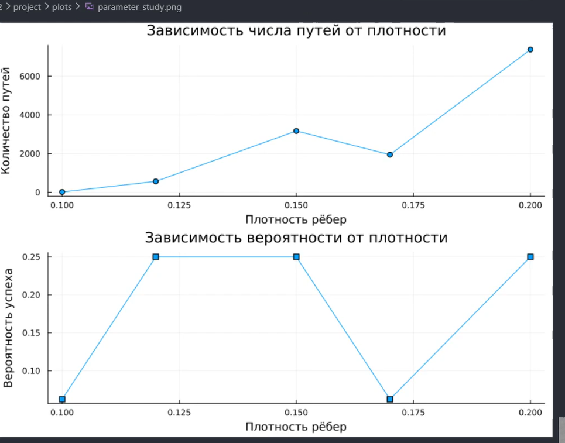{#fig-001 width="70%"}


Интегрировал документацию с параметрами в формате Quarto в отчёт.

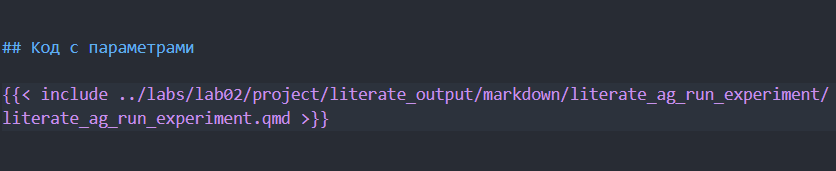{#fig-001 width="70%"}

## Реализация модуля AttackGraph

Модуль AttackGraph содержит функции для построения графа атак, поиска путей, вычисления метрик центральности и оценки вероятностей. Полный код модуля находится в файле `src/attack_graph.jl` в проекте DrWatson.

Основные экспортируемые функции:
- build_attack_graph — построение графа атак
- find_all_paths — поиск всех путей от источника к цели
- compute_centrality_metrics — вычисление метрик центральности
- most_likely_path — поиск наиболее вероятного пути атаки

В скриптах модуль подключается командой:
```julia
include(joinpath(projectdir(), "src", "attack_graph.jl"))
using .AttackGraph

## Запуск эксперимента



## Анализ и визуализация



## Исследование масштабируемости



## Параметрическое исследование



## Код с параметрами


```

## Ответы на контрольные вопросы

1. Что такое граф атак и для чего он используется? Граф атак - это ориентированный граф, вершины которого представляют узлы сети (хосты, серверы, рабочие станции) или состояния системы, а рёбра - возможные действия атакующего для перехода от одного узла к другому (например, через эксплуатацию уязвимости). Он используется для анализа уязвимостей сетевой инфраструктуры, поиска всех возможных путей атаки от злоумышленника к критическим активам, оценки рисков и вероятности успешной атаки, а также для выявления наиболее критичных узлов сети, требующих усиленной защиты.

2. Какие алгоритмы поиска путей применяются в анализе графов атак? В анализе графов атак применяются три основных алгоритма. DFS (поиск в глубину) используется для нахождения всех возможных путей атаки рекурсивным обходом графа. BFS (поиск в ширину) применяется для нахождения кратчайшего пути от источника к цели. Алгоритм Дейкстры используется для поиска наименее сложного или наиболее вероятного пути с учётом весов рёбер, где весом может быть сложность эксплуатации уязвимости или логарифм обратной вероятности успеха.

3. Что означают метрики центральности (in-degree, PageRank) в контексте безопасности? В контексте безопасности in-degree (входящая степень) показывает, сколько узлов могут атаковать данный узел. Высокое значение in-degree означает, что узел является популярной целью для атак и потенциально наиболее уязвим. PageRank - это мера важности узла, учитывающая важность узлов, которые на него ссылаются. Высокий PageRank означает, что узел является критическим звеном в сети атак: его компрометация открывает доступ ко многим другим узлам, даже если напрямую к нему ведёт немного атак.

4. Как можно оценить вероятность успешной атаки с помощью весов рёбер? Вероятность успешной атаки по определённому пути оценивается как произведение вероятностей успеха на каждом ребре этого пути. Если каждому ребру присвоить вес - вероятность того, что атакующий успешно перейдёт с одного узла на другой (например, на основе CVSS-оценки уязвимости), то вероятность успеха по всему пути вычисляется как произведение этих вероятностей. Для поиска наиболее вероятного пути используется алгоритм Дейкстры с весом, равным отрицательному логарифму вероятности, что преобразует произведение в сумму и позволяет применить стандартные алгоритмы поиска кратчайшего пути.

5. Какие ограничения имеет модель графа атак в реальных условиях? Модель графа атак имеет несколько существенных ограничений. Во-первых, она статична и не учитывает изменение конфигурации сети во времени. Во-вторых, она не учитывает защитные механизмы, такие как межсетевые экраны, системы обнаружения вторжений (IDS) и антивирусы. В-третьих, модель игнорирует временные факторы - время выполнения атаки, скорость обнаружения, время реакции защиты. В-четвёртых, она не учитывает человеческий фактор - социальную инженерию, ошибки администраторов, фишинг. В-пятых, для больших сетей количество возможных путей атаки растёт экспоненциально, что делает полный перебор вычислительно сложным или невозможным.

6. Как можно расширить модель для учёта защитных механизмов (например, межсетевые экраны)? Модель графа атак можно расширить несколькими способами. Во-первых, добавить блокирующие правила - удалить рёбра, которые перекрываются межсетевыми экранами или другими средствами защиты. Во-вторых, ввести вероятности обнаружения - добавить к ребру вес, отражающий вероятность того, что атака будет обнаружена и заблокирована. В-третьих, добавить узлы-защитники - ввести специальные узлы, представляющие средства защиты (фаерволы, IDS, IPS), и связать их с атакуемыми узлами. В-четвёртых, использовать взвешенные рёбра с учётом защиты - уменьшить вероятность успеха для атак, проходящих через защищённые сегменты сети. В-пятых, моделировать многошаговые атаки с обходом защиты - добавлять альтернативные пути атаки, когда прямой путь заблокирован.

# Выводы

В ходе выполнения лабораторной работы я освоил методы построения и анализа графов атак для оценки уязвимостей сетевой инфраструктуры. На примере моделирования атак на корпоративную сеть изучил: представление сетевой топологии и уязвимостей в виде ориентированного графа; алгоритмы поиска всех возможных путей атаки от начальных точек до целевых активов; расчёт метрик центральности для определения критических узлов; визуализацию графа с цветовой индикацией уровня риска; оценку вероятности успешной атаки с учётом сложности эксплуатации уязвимостей.

# Список литературы {.unnumbered}

1. A Multi-Language Computing Environment for Literate Programming and Reproducible Research / E. Schulte [et al.] // Journal of Statistical Software. — 2012. —
Vol. 46, no. 3. — ISSN 1548-7660. — DOI: 10.18637/jss.v046.i03.
2. Knuth D. E. Literate Programming // The Computer Journal. — 1984. — Feb. — Vol. 27,
no. 2. — P. 97–111. — ISSN 1460-2067. — DOI: 10.1093/comjnl/27.2.97.
3. The Story in the Notebook / M. B. Kery [et al.] // Proceedings of the 2018 CHI Conference on Human Factors in Computing Systems. — ACM, 04/2018. — P. 1–11. — DOI:
10.1145/3173574.3173748.
