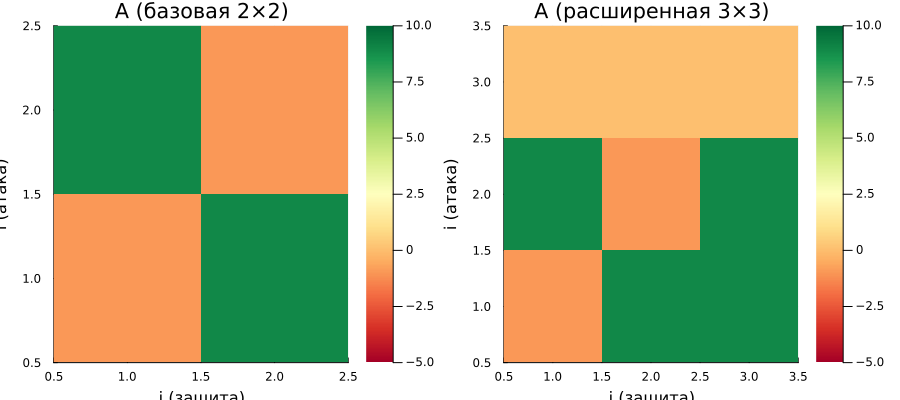

---
## Author
author:
  name: Ахлиддинзода Аслиддин
  degrees: MSc
  email: 1032259392@rudn.ru
  affiliation:
    - name: Российский университет дружбы народов
      country: Российская Федерация
      postal-code: 117198
      city: Москва
      address: ул. Миклухо-Маклая, д. 6
## Title
title: "Лабораторная работа №4"
subtitle: "Моделирование конфликта защитник–нападающий"
license: CC BY
date: today
date-format: "YYYY-MM-DD"
---

# Информация

## Докладчик

:::::::::::::: {.columns align=center}
::: {.column width="70%"}

  * Ахлиддинзода Аслиддин
  * студент группы НФИмд-01-25
  * Российский университет дружбы народов
  * [1032259392@rudn.ru](mailto:1032259392@rudn.ru)
  * <https://github.com/aslidin12>

:::
::: {.column width="30%"}

:::
::::::::::::::

# Цель работы

- Освоить методы **теории игр** для моделирования конфликта защитник–нападающий
- Изучить:
  - построение платёжных матриц биматричной игры
  - поиск равновесия Нэша в чистых и смешанных стратегиях
  - влияние параметров модели на равновесные стратегии
  - визуализацию и сравнение сценариев

# Задание

- Реализовать построение платёжных матриц для игры защитник–нападающий
- Реализовать поиск равновесия Нэша (чистые и смешанные стратегии)
- Провести систематический анализ: перебор параметров $V$, $c_a$, $c_d$
- Визуализировать зависимость равновесных стратегий от параметров
- Расширить игру до 3×3: добавить стратегии «не атаковать» и «не защищать»

# Теоретическое введение

## Биматричная игра

**Биматричная игра** — модель взаимодействия двух игроков с отдельными матрицами выигрышей:

- **Нападающий**: выбирает, какой актив атаковать ($i = 1, \ldots, n$)
- **Защитник**: выбирает, какой актив охранять ($j = 1, \ldots, n$)

Платёжные матрицы:

$$A_{ij} = \begin{cases} V_i - c_a, & i \neq j \\ -c_a, & i = j \end{cases} \qquad D_{ij} = \begin{cases} -V_i - c_d, & i \neq j \\ -c_d, & i = j \end{cases}$$

# Теоретическое введение

## Равновесие Нэша

- **Чистое**: один игрок атакует/защищает конкретный актив с вероятностью 1 (седловая точка)
- **Смешанное**: каждый игрок рандомизирует стратегии так, чтобы противник был безразличен к выбору

Смешанное равновесие находится из **условия безразличия**:

$$p^{*\top} A q^* \geq p^\top A q^* \quad \forall p \qquad p^{*\top} D q^* \geq p^{*\top} D q \quad \forall q$$

# Выполнение

## Равновесная стратегия нападающего

{width=60%}

# Выполнение

## Средний выигрыш нападающего

{width=60%}

# Дополнительное задание

## Расширение до игры 3×3

Добавлены пассивные стратегии:

- Нападающий: «**не атаковать**» — выигрыш всегда 0
- Защитник: «**не защищать ничего**» — нападающий гарантированно получает $V_i - c_a$

{width=65%}

# Выводы

Разработана модель конфликта защитник–нападающий на основе теории игр:

- **Платёжные матрицы**: построены для двух активов с учётом ценностей и стоимостей
- **Равновесие Нэша**: реализован поиск чистых и смешанных стратегий
- **Анализ параметров**: рост $c_a$ снижает активность нападающего; при $V_1 \gg V_2$ оба игрока концентрируются на первом активе
- **Игра 3×3**: пассивные стратегии расширяют множество равновесий
