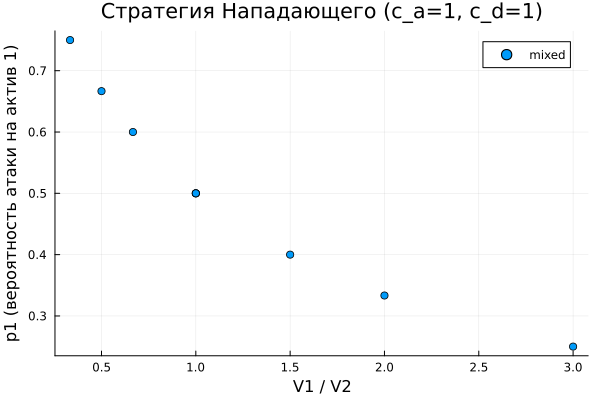
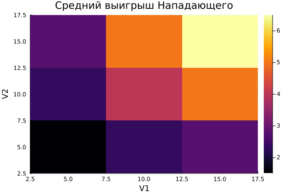

---
## Author
author:
  name: Ахлиддинзода Аслиддин
  degrees: MSc
  email: 1032259392@rudn.ru
  affiliation:
    - name: Российский университет дружбы народов
      country: Российская Федерация
      postal-code: 117198
      city: Москва
      address: ул. Миклухо-Маклая, д. 6

## Title
title: "Лабораторная работа №4"
subtitle: "Моделирование конфликта защитник–нападающий"
license: "CC BY"
---

# Цель работы

- Освоить методы теории игр для моделирования конфликта между защитником и нападающим в задачах информационной безопасности.
- На примере биматричной игры изучить:
  - построение платёжных матриц защитника и нападающего;
  - поиск равновесия Нэша в чистых и смешанных стратегиях;
  - анализ влияния параметров модели (ценности активов, стоимости атаки и защиты) на равновесные стратегии;
  - визуализацию результатов и сравнение сценариев.

# Задание

- Реализовать построение платёжных матриц для биматричной игры защитник–нападающий.
- Реализовать поиск равновесия Нэша в чистых и смешанных стратегиях для игры 2×2.
- Провести систематический анализ: перебор параметров (ценности активов, стоимости атаки и защиты) и сохранение результатов.
- Визуализировать зависимость равновесных стратегий от параметров.
- Дополнительно: расширить игру до 3×3, добавив стратегии «не атаковать» и «не защищать».

# Теоретическое введение

Julia — высокоуровневый свободный язык программирования с динамической типизацией, созданный для математических вычислений [@julialang]. Эффективен также и для написания программ общего назначения. Синтаксис языка схож с синтаксисом других математических языков, однако имеет некоторые существенные отличия.

**Биматричная игра** — модель стратегического взаимодействия двух игроков, в которой каждый игрок имеет конечное множество стратегий, а исходы задаются двумя отдельными матрицами выигрышей [@myerson_game_theory]. В задаче моделирования информационной безопасности нападающий (атакующий) выбирает, какой актив атаковать, а защитник — какой актив охранять.

Платёжные матрицы строятся следующим образом: если нападающий атакует актив $i$, а защитник охраняет актив $j$:

- при $i \neq j$: атака успешна — нападающий получает $V_i - c_a$, защитник теряет $V_i + c_d$;
- при $i = j$: атака отражена — нападающий теряет $c_a$, защитник несёт затраты $c_d$.

**Равновесие Нэша** — набор стратегий, при котором ни один из игроков не может увеличить свой выигрыш, отклонившись от выбранной стратегии в одностороннем порядке [@nash_game_theory]. В игре 2×2 равновесие бывает:

- **чистое** (седловая точка): один игрок атакует/защищает конкретный актив с вероятностью 1;
- **смешанное**: каждый игрок случайным образом выбирает стратегию согласно вычисленному распределению вероятностей.

Смешанное равновесие находится из условия безразличия: каждый игрок должен быть безразличен к выбору своих чистых стратегий при фиксированной стратегии противника.

# Выполнение лабораторной работы

Для выполнения работы создан проект с помощью DrWatson [@drwatson]. Основной модуль `src/simulation.jl` содержит все функции: построение платёжных матриц, поиск равновесия Нэша в чистых и смешанных стратегиях, запуск симуляций по сетке параметров и сохранение результатов в CSV.

Скрипт `scripts/run_sims.jl` выполняет однократный запуск: перебирает 81 комбинацию параметров (три значения $V_1$, три $V_2$, три $c_a$, три $c_d$) и сохраняет результаты в `data/sims/results.csv`.

Скрипт `scripts/plot_results.jl` загружает сохранённые данные и строит два графика: scatter-диаграмму зависимости равновесной вероятности атаки $p_1$ от отношения $V_1/V_2$ ([рис. @fig-001]) и тепловую карту среднего выигрыша нападающего $U_A$ по сетке значений $V_1 \times V_2$ ([рис. @fig-002]).

{#fig-001 width=70%}

{#fig-002 width=70%}

Скрипт `scripts/extra_tasks.jl` реализует дополнительное задание: расширение игры 2×2 до 3×3 за счёт добавления стратегии «не атаковать» для нападающего и «не защищать ничего» для защитника. На рисунке показано сравнение платёжных матриц базовой и расширенной моделей ([рис. @fig-003]).

{#fig-003 width=70%}

## Контрольные вопросы

**1. Биматричная игра** — это игра двух лиц в нормальной форме, в которой каждый игрок имеет конечное множество чистых стратегий, а исходы задаются двумя матрицами выигрышей (по одной на каждого игрока). В отличие от антагонистических (нулевых) игр, в биматричной игре выигрыши игроков не обязаны суммироваться в ноль.

**2. Равновесие Нэша** — профиль стратегий $(p^*, q^*)$, при котором выполняется:
$$p^{*\top} A q^* \geq p^\top A q^* \quad \forall p, \qquad p^{*\top} D q^* \geq p^{*\top} D q \quad \forall q.$$
Существование гарантируется теоремой Нэша для любой конечной игры.

**3. Нахождение смешанного равновесия** в игре 2×2 выполняется через условие безразличия: нападающий должен быть безразличен к обеим своим стратегиям при фиксированной стратегии защитника, и наоборот. Это даёт систему линейных уравнений относительно смешанных стратегий.

**4. Влияние параметров** на равновесие:

- Рост $c_a$ снижает выгоду атаки, нападающий переходит к пассивности (уменьшается $p_1$).
- Рост $c_d$ делает активную защиту менее выгодной; при высоком $c_d$ защитник может предпочесть не защищать дорогостоящий актив.
- При $V_1 \gg V_2$ нападающий концентрируется на активе 1 ($p_1 \to 1$), защитник вынужден делать то же.

**5. Чистое vs. смешанное равновесие:**

- Чистое (седловая точка) существует, когда один и тот же исход оптимален для обоих игроков одновременно.
- Смешанное возникает при отсутствии седловой точки: каждый игрок рандомизирует, чтобы сделать противника безразличным к своим стратегиям.

**6. Расширение до 3×3** (добавление стратегий «не атаковать» / «не защищать»):

- Нападающий может отказаться от атаки: его выигрыш равен 0 вне зависимости от действий защитника.
- Защитник может не охранять ни одного актива: нападающий гарантированно получает $V_i - c_a$.
- Добавление пассивных стратегий расширяет множество равновесий: при высоких $c_a$ или $c_d$ игроки могут предпочесть пассивность.







# Выводы

Разработана модель конфликта защитник–нападающий на основе теории биматричных игр:

- построены платёжные матрицы для двух активов с учётом ценностей и стоимостей атаки и защиты;
- реализован поиск равновесия Нэша в чистых и смешанных стратегиях;
- проведён систематический анализ влияния параметров: при росте стоимости атаки нападающий переходит к пассивности, при асимметрии ценностей — концентрируется на более ценном активе;
- дополнительно реализована игра 3×3 с пассивными стратегиями, показавшая расширение множества равновесий.

# Список литературы{.unnumbered}

::: {#refs}
:::
